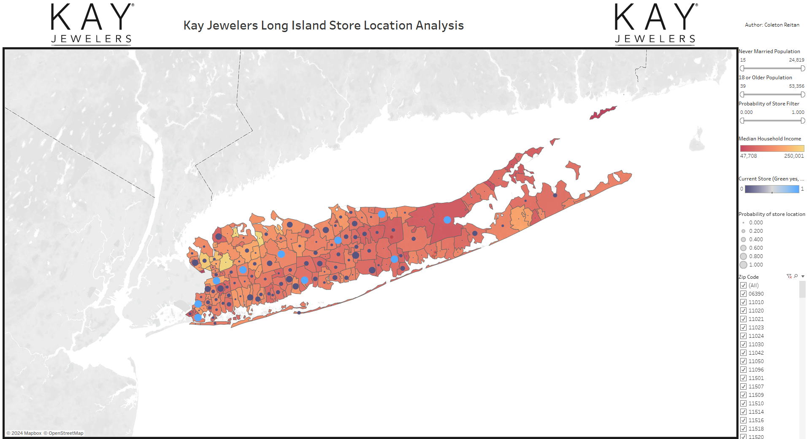

# Kay Jewelers Long Island Location Analysis

## Project Overview  
This is a personal project I took on to further my understanding of mapping in Tableau. 
The goal is to create a dashboard that could give some insight as to possible locations for new Kay Jewelers stores on Long Island. 

In this project, Long Island demographic and Location data is sourced from the Stanford Data Commons, and Kay Jewelers store locations are taken from Google Maps. Machine learning modeling in python is employed on the data to determine locations on Long Island similar to existing stores. Lastly, the data and new information is uploaded into Tableau and a map-based dashboard is created.  

The dashboard link can be found here:   
https://public.tableau.com/app/profile/coleton.reitan7808/viz/KaysLongIslandStoreLocations/KayJewelersLocationAnalysis?publish=yes 

### Dashboard Screenshot

The dashboard can be filtered by Never Married Population, 18 or Older Population, or Probability of Store.   
The big light blue dots represent existing stores. The dark blue dots represent towns on Long Island, and the bigger the dot, the higher probability of a new Kay Jewelers store location.   
The coloring of Long Island represents the median household income of a town - a gradient from dark red (lower income) to gold (higher income).  

## Creation Process
This was a multi-step process that involved downloading and cleaning data from the Stanford Data Commons and Google Maps, employing a RandomForestClassifier in python, and creating a dashboard in Tableau.   

Data Cleaning and Machine Learning Code

### 1) Downloading Data from Stanford Data Commons and Google Maps
https://datacommons.stanford.edu/

Nassau and Suffolk County Data was filtered for and downloaded from the Stanford Data Commons.   
Features included from the downloaded data included:
  - PlaceName  
    Zip Code of cities/towns on Long Island    
  - Median Income Household  
    The median household income per town on Long Island  
  - Person 18 or More Years  
    The count of people per town who are 18 years or older  
  - Person Never Married  
    The count of people per town who have never been married  
  - Person Married and Not Separated  
    The count of people per town who are married and not separated  

This was a quick analysis where only a few features were taken to be used in a classification model.  

Kay Jewelers store locations were taken from Google Maps.      
This was noted by an additional binary column. 

  - Store Present  
    Binary column noting if a Kay Jewelers store is present per town (binary, 1 yes, 0 no)  

   
### 2) Employing a Machine Learning Model

The original data is very biased, as there are only 10 Kay Jewelers stores on Long Island. In order to correct for this SMOTE was used to oversample the minority class (making the imbalanced data balanced).   

Once the classes were balanced, a Random Forest Classifier machine learning model was used to determine (and score a probability) of the likelihood for a Kay Jewelers store in towns on Long Island.   

#### Model Confusion Matrix
| Class | Precision | Recall | F1-Score | Support |
|-------|-----------|--------|----------|---------|
| 0     | 0.94      | 0.68   | 0.79     | 47      |
| 1     | 0.06      | 0.33   | 0.11     | 3       |
| **Accuracy**  |       |        | 0.66     | 50      |
| **Macro Avg** | 0.50      | 0.51   | 0.45     | 50      |
| **Weighted Avg** | 0.89  | 0.66   | 0.75     | 50      |

Based on this confusion table, it can be seen that there may be lower than anticipated reliability in determining areas where a Kay Jewelers store is located. However, this could be attributed to the class imbalance and creation of artificial data through the use of SMOTE.  
The model does do a good job of determining locations where a store is not, so the model is totally invaluable.   

The predicted probability of a store location for each town was then kept in the dataframe. Following, the dataframe was downloaded to a csv. 

### 3) Creating Dashboard in Tableau

The new .csv with the predicted probability of a store location was then imported into Tableau. After dashboard creation, the dashboard was put into Tableau Public. 

Since each town on Long Island had a corresponding zip code, Tableau was easily able to map it onto its map feature. Two maps were then created, and a dual axis was used to put two different map stories on top of eachother. 
  

### 4) Application

The goal was to find the most similar locations to those of the existing Kay Jewelers stores, based on the limited demographic variables being used. From analysis, the top 10 locations are as follows (zip codes):

| Zip Code  | Final_Probability |
|-----------|-------------------|
| 11742     | 0.92              |
| 11772     | 0.81              |
| 11542     | 0.78              |
| 11703     | 0.77              |
| 11550     | 0.76              |
| 11021     | 0.76              |
| 11795     | 0.72              |
| 11783     | 0.71              |
| 11780     | 0.70              |
| 11010     | 0.69              |
